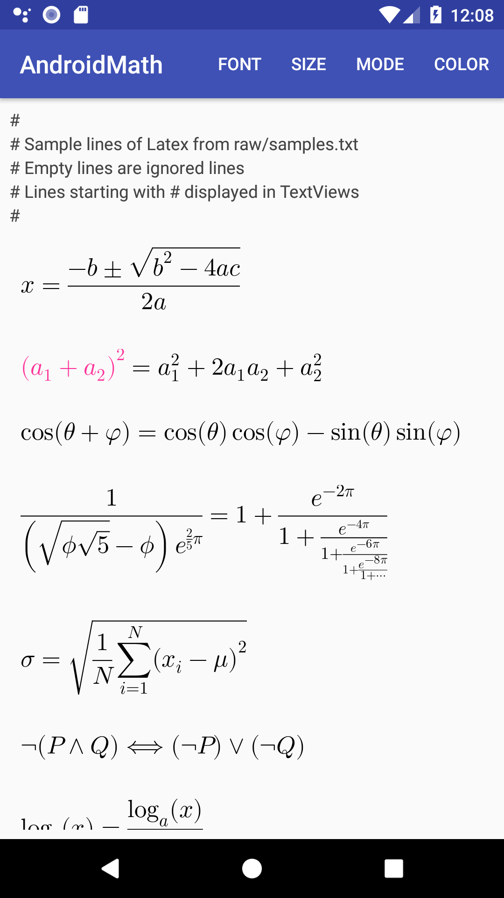

# AndroidMath

- [x] Rendering of LaTeX Math inside of an Android View
- [x] No dependency on WebView
- [x] Easy to use.



Installation of this repo
--------------------------
All you need to do is clone this project, run CDep, and build.
CDep pulls in the freetype dependency.

```
git clone https://github.com/gregcockroft/AndroidMath.git

cd LaTexMath
cd mathdisplaylib
./cdep 
cd ..
./gradlew installDebug
```

You can also open the project in Android Studio and run it.


Using library in your app
-------------------------

XXX jitpack integration for external apps in progress. Still not working. Look at internal sample app for now.

Add below lines to root's build.gradle

```groovy
	allprojects {
		repositories {
			...
			maven { url 'https://jitpack.io' }
		}
	}
```

Add below lines to apps's build.gradle

```groovy
dependencies {
	        implementation 'com.github.gregcockroft:AndroidMath:fc9d9da40a'
	}
	
```

#### In Activity:
Look at [MainActivty.kt](./sampleapp/src/main/java/com/agog/latexmathsample/MainActivity.kt)

#### API
Look at [MTMathView](https://rawgit.com/gregcockroft/AndroidMath/master/mathdisplaylib/doc/com.agog.mathdisplay/-m-t-math-view/index.html)
This is the central access class.

#### Credits:


* [iosMath](https://github.com/kostub/iosMath) This project is a Kotlin port for Android of the iosMath project 
* [Freetype](https://www.freetype.org/) is used for rendering glyphs and font metrics.
* [Freetype jni](https://github.com/mlomb/freetype-jni) was copied as a starting point to access the native  freetype library.


## Related Projects

* [MathView](https://github.com/kexanie/MathView) uses [MathJax](http://www.mathjax.org/) in a WebView to render math on Android.

For people looking for things beyond just rendering math, there are two
related projects:

* [MathEditor](https://github.com/kostub/MathEditor): A WYSIWYG editor
  for math equations on iOS.
* [MathSolver](https://github.com/kostub/MathSolver): A library for
  solving math equations.
  
## License

AndroidMath is available under the MIT license. See the [LICENSE](./LICENSE)
file for more info.

### Fonts
This distribution contains the following fonts. These fonts are
licensed as follows:
* Latin Modern Math: 
    [GUST Font License](./mathdisplaylib/src/main/assets/fonts/GUST-FONT-LICENSE.txt)
* Tex Gyre Termes:
    [GUST Font License](./mathdisplaylib/src/main/assets/fonts/GUST-FONT-LICENSE.txt)
* [XITS Math](https://github.com/khaledhosny/xits-math):
    [Open Font License](./mathdisplaylib/src/main/assets/fonts/OFL.txt)
